# RDP Web Client

Browser-based Remote Desktop client using vanilla JavaScript frontend and a Python WebSocket proxy with native FreeRDP3 integration.

## Architecture

```
┌─────────────┐      WebSocket                 ┌─────────────────┐     RDP/GFX    ┌──────────────┐
│   Browser   │ ◄────────────────────────────► │  Python Proxy   │ ◄────────────► │  Windows VM  │
│  (HTML/JS)  │   H.264 + WebP + Opus + input  │ (Native FreeRDP)│  AVC444/AVC420 │              │
└─────────────┘                                └─────────────────┘                └──────────────┘
```

### Components

- **Frontend**: Vanilla JavaScript SPA served by nginx (port 8000)
- **Backend**: Python WebSocket server with native C library for FreeRDP3 integration (port 8765)
- **Native Bridge**: C library (`librdp_bridge.so`) for direct RDP connection with zero-copy frame capture

## Features

- 🎬 **RDP GFX pipeline with H.264/AVC444** - Hardware-accelerated video streaming
- 🔄 **AVC444 → 4:2:0 transcoding** - Server-side FFmpeg conversion for browser compatibility
- 🖼️ **Hybrid rendering** - H.264 for video content, WebP delta tiles for UI/scrolling
- 🎯 **Multiple GFX codecs** - ClearCodec, Planar, Uncompressed decoded server-side
- 🖥️ Real-time screen streaming via WebSocket (H.264 + WebP delta tiles)
- 🔊 Native audio streaming with Opus encoding (per-session isolation)
- ⌨️ Full keyboard support with scan code translation
- 🖱️ Mouse support (move, click, drag, wheel - horizontal & vertical)
- 📺 Fullscreen mode with dynamic resolution
- 🔄 Delta frame updates with dirty rectangle tracking
- 📊 Latency monitoring (ping/pong)
- 🩺 Health check endpoint (`/health`)
- 🐳 Docker support with multi-stage builds
- 👥 Multi-user support (isolated RDP sessions per WebSocket connection)

## Todo (Best Effort)
- long term GFX optimizations (client side rendering and caching)
- Clipboard support (copy/paste)
- File transfer support
- NVENC/VAAPI hardware transcoding (currently software FFmpeg)

## Tech Stack

### Backend
- **Python 3.x** with `websockets` for async WebSocket server
- **Native C library** built with FreeRDP3 SDK (compiled from source with H.264 support)
- **RDPGFX channel** for H.264/AVC444 video (MS-RDPEGFX protocol)
- **FFmpeg (libavcodec)** for AVC444 → 4:2:0 transcoding
- **RDPSND bridge plugin** for direct audio capture (no PulseAudio or Alsa required)
- **libopus** for Opus audio encoding (64kbps, 20ms frames)
- **PIL/Pillow** for image processing (WebP fallback)
- **Ubuntu 24.04** base image

> **Note**: Ubuntu's FreeRDP3 package is compiled *without* H.264 support. The Docker build 
> compiles FreeRDP3 from source with `-DWITH_FFMPEG=ON` to enable H.264/AVC444 codec negotiation.

### Frontend
- **Vanilla JavaScript** (no frameworks)
- **HTML5 Canvas** for rendering RDP frames
- **WebCodecs VideoDecoder** for H.264 decoding (hardware accelerated)
- **WebCodecs AudioDecoder** for Opus decoding
- **nginx:alpine** for static file serving

### Browser Requirements
- **Chrome 94+** or **Edge 94+** or **Safari 26+** or **Firefox 130+** (required for WebCodecs AudioDecoder)

## Quick Start with Docker (Recommended)

The easiest way to run the application is using Docker Compose:

```bash
# Build and start both services
docker-compose up -d

# View logs
docker-compose logs -f

# Stop services
docker-compose down
```

- **Frontend**: http://localhost:8000
- **Backend WebSocket**: ws://localhost:8765
- **Health Check**: http://localhost:8765/health

## Manual Setup

### Backend

The backend requires building the native C library against FreeRDP3. This is best done inside Docker.

```bash
cd backend
docker build -t rdp-backend .
docker run --rm -it -p 8765:8765 rdp-backend
```

### Frontend

```bash
cd frontend
docker build -t rdp-frontend .
docker run --rm -it -p 8000:8000 rdp-frontend

# Then open http://localhost:8000
```

## Frontend Integration

The RDP client is available as a reusable ES module with Shadow DOM isolation, making it easy to integrate into any web application.

### Quick Start

#### 1. Import the module

```javascript
import { RDPClient } from './rdp-client.js';
```

#### 2. Create an instance

```javascript
const client = new RDPClient(document.getElementById('container'), {
  wsUrl: 'ws://localhost:8765',
  showTopBar: true,    // Show/hide the connection toolbar
  showBottomBar: true  // Show/hide the status bar
});
```

#### 3. Connect programmatically

```javascript
await client.connect({
  host: '192.168.1.100',
  port: 3389,
  user: 'Administrator',
  pass: 'password'
});
```

### Configuration Options

| Option | Type | Default | Description |
|--------|------|---------|-------------|
| `wsUrl` | string | `'ws://localhost:8765'` | WebSocket server URL |
| `showTopBar` | boolean | `true` | Show/hide the top toolbar |
| `showBottomBar` | boolean | `true` | Show/hide the bottom status bar |
| `reconnectDelay` | number | `3000` | Reconnection delay in milliseconds |
| `mouseThrottleMs` | number | `16` | Mouse move event throttle (~60fps) |
| `resizeDebounceMs` | number | `2000` | Resize debounce delay |

### Public API

| Method | Description |
|--------|-------------|
| `connect(credentials)` | Connect to RDP server. Returns a Promise. |
| `disconnect()` | Disconnect the current session |
| `sendKeys(keys, opts)` | Send keystrokes. Options: `{ ctrl, alt, shift, meta, delay }` |
| `sendKeyCombo(combo)` | Send key combination (e.g., `'Ctrl+Alt+Delete'`) |
| `sendCtrlAltDel()` | Shortcut for `sendKeyCombo('Ctrl+Alt+Delete')` |
| `getStatus()` | Returns `{ connected, resolution, muted }` |
| `getMuted()` | Returns current mute state (boolean) |
| `setMuted(bool)` | Set audio mute state |
| `getResolution()` | Returns `{ width, height }` or `null` if not connected |
| `on(event, handler)` | Register an event handler |
| `off(event, handler)` | Remove an event handler |
| `destroy()` | Clean up resources and remove from DOM |

### Events

| Event | Data | Description |
|-------|------|-------------|
| `'connected'` | `{ width, height }` | RDP session established |
| `'disconnected'` | - | Session ended |
| `'resize'` | `{ width, height }` | Resolution changed |
| `'error'` | `{ message }` | Error occurred |

### Full Example

```html
<!DOCTYPE html>
<html>
<head>
  <title>My RDP App</title>
  <style>
    #rdp-container {
      width: 100%;
      height: 600px;
    }
  </style>
</head>
<body>
  <div id="rdp-container"></div>
  
  <script type="module">
    import { RDPClient } from './rdp-client.js';

    const client = new RDPClient(document.getElementById('rdp-container'), {
      wsUrl: 'ws://localhost:8765',
      showTopBar: true,
      showBottomBar: false
    });

    // Event handlers
    client.on('connected', ({ width, height }) => {
      console.log(`Connected at ${width}x${height}`);
    });

    client.on('disconnected', () => {
      console.log('Session ended');
    });

    client.on('error', ({ message }) => {
      console.error('RDP Error:', message);
    });

    client.on('resize', ({ width, height }) => {
      console.log(`Resolution changed to ${width}x${height}`);
    });

    // Connect automatically
    client.connect({
      host: '192.168.1.100',
      port: 3389,
      user: 'admin',
      pass: 'secret'
    }).catch(err => console.error(err));

    // Expose for debugging
    window.rdpClient = client;
  </script>
</body>
</html>
```

## Usage

1. Open http://localhost:8000 in your browser
2. Click **Connect**
3. Enter VM details:
   - **Host**: IP or hostname of Windows VM
   - **Port**: RDP port (default: 3389)
   - **Username**: Windows username
   - **Password**: Windows password
4. Click **Connect** in the modal

## WebSocket Protocol

### Client → Server Messages

| Type | Description | Fields |
|------|-------------|--------|
| `connect` | Start RDP session | `host`, `port`, `username`, `password`, `width`, `height` |
| `disconnect` | End session | - |
| `mouse` | Mouse event | `action`, `x`, `y`, `button`, `deltaX`, `deltaY` |
| `key` | Keyboard event | `action`, `code`, `key` |
| `resize` | Request resolution change | `width`, `height` |
| `ping` | Latency measurement | - |

### Server → Client Messages

| Type | Description | Fields |
|------|-------------|--------|
| `connected` | Session started | `width`, `height` |
| `disconnected` | Session ended | - |
| `error` | Error occurred | `message` |
| `pong` | Ping response | - |
| Binary (H264) | H.264 frame | 25-byte header + NAL data (AVC420/AVC444) |
| Binary (WebP) | Full frame | Raw WebP image data (initial frame only) |
| Binary (DELT) | Delta frame | Header + dirty rects + WebP tiles (ClearCodec, fills, scrolling) |
| Binary (OPUS) | Audio frame | 8-byte header + Opus packet |

## Configuration

### Backend Environment Variables

| Variable | Default | Description |
|----------|---------|-------------|
| `WS_HOST` | `0.0.0.0` | WebSocket bind address |
| `WS_PORT` | `8765` | WebSocket port |
| `LOG_LEVEL` | `INFO` | Logging verbosity |
| `RDP_MAX_SESSIONS` | `100` | Maximum concurrent RDP sessions (range: 2-1000) |

### Frontend Configuration (app.js)

```javascript
const config = {
    wsUrl: 'ws://localhost:8765',      // WebSocket server URL
    mouseThrottleMs: 16,                // Mouse event throttling (~60fps)
    resizeDebounceMs: 2000,             // Resize debounce delay
};
```

## Project Structure

```
├── docker-compose.yml      # Multi-service orchestration
├── backend/
│   ├── Dockerfile          # Multi-stage build (Ubuntu 24.04)
│   ├── server.py           # WebSocket server entry point
│   ├── rdp_bridge.py       # Python wrapper for native library
│   ├── requirements.txt    # Python dependencies
│   └── native/
│       ├── CMakeLists.txt  # CMake build configuration
│       ├── rdp_bridge.c    # FreeRDP3 + GFX codecs + FFmpeg transcoding
│       ├── rdp_bridge.h    # Library header
│       ├── rdpsnd_bridge.c # RDPSND audio plugin (Opus encoding)
│       └── GFX_DEBUGGING_NOTES.md  # GFX pipeline debugging notes
└── frontend/
    ├── Dockerfile          # nginx:alpine image
    ├── index.html          # SPA entry point
    ├── app.js              # RDP client logic (+ H.264/Opus decoding)
    └── nginx.conf          # nginx configuration
```

## Video Architecture (GFX Pipeline)

The RDPGFX channel (MS-RDPEGFX) provides a hybrid rendering pipeline:

### H.264 Path (Video Content)
```
┌─────────────┐    AVC444/420     ┌─────────────────┐    Transcode     ┌──────────────┐
│  Windows VM │ ──────────────►   │  Native Bridge  │ ────────────────►│  H.264 Queue │
│   (Video)   │   H.264 NALs      │  (FFmpeg 4:4:4  │   AVC420 4:2:0   │  (per-user)  │
└─────────────┘                   │   → 4:2:0)      │                  └──────────────┘
                                  └─────────────────┘                         │
                                                                              ▼
┌─────────────┐      WebSocket    ┌─────────────────┐     WebCodecs    ┌──────────────┐
│   Browser   │ ◄───────────────  │  Python Proxy   │ ◄────────────────│ VideoDecoder │
│  (Canvas)   │   H264 frames     │  (rdp_bridge)   │   H.264→RGB      │  (HW accel)  │
└─────────────┘                   └─────────────────┘                  └──────────────┘
```

### Tile Codec Path (UI, Text, Scrolling)
```
┌─────────────┐   ClearCodec/     ┌─────────────────┐    Dirty Rects   ┌──────────────┐
│  Windows VM │   Planar/Fill/    │  Native Bridge  │ ────────────────►│  Framebuffer │
│    (UI)     │   SurfaceToSurf   │  (Decode/Blit)  │   BGRA32 pixels  │  (per-user)  │
└─────────────┘                   └─────────────────┘                  └──────────────┘
                                                                              │
                                                                              ▼
┌─────────────┐      WebSocket    ┌─────────────────┐      WebP        ┌──────────────┐
│   Browser   │ ◄───────────────  │  Python Proxy   │ ◄────────────────│   Encoder    │
│  (Canvas)   │   DELT frames     │  (rdp_bridge)   │   Delta tiles    │  (Pillow)    │
└─────────────┘                   └─────────────────┘                  └──────────────┘
```

**Key benefits:**
- **H.264 hardware decode**: Browser's VideoDecoder with GPU acceleration
- **AVC444 support**: Server-side FFmpeg transcoding (4:4:4 → 4:2:0)
- **Low latency**: ultrafast/zerolatency preset, no B-frames
- **Hybrid rendering**: H.264 for video, WebP delta for UI updates
- **Efficient scrolling**: SurfaceToSurface/CacheToSurface sent as delta tiles

**GFX Codec Support:**
| Codec | Description | Output |
|-------|-------------|--------|
| AVC420 | H.264 4:2:0 | Pass-through to browser |
| AVC444/v2 | H.264 4:4:4 | FFmpeg transcode → H.264 |
| ClearCodec | Lossless tiles | Decode → WebP delta |
| Planar | RLE compressed | Decode → WebP delta |
| Uncompressed | Raw BGRA | Copy → WebP delta |

**Surface Operations (→ WebP delta):**
- `SolidFill` - Fill rectangles with color
- `SurfaceToSurface` - Copy/scroll regions
- `CacheToSurface` - Restore cached bitmaps
- `SurfaceToCache` - Store bitmaps for later

## Audio Architecture

Audio uses a custom RDPSND device plugin that captures PCM directly from FreeRDP and encodes to Opus:

```
┌─────────────┐      RDPSND       ┌─────────────────┐      Opus        ┌──────────────┐
│  Windows VM │ ──────────────►   │  rdpsnd-bridge  │ ────────────────►│  Ring Buffer │
│   (Audio)   │   PCM 44.1kHz     │  (Opus Encoder) │   64kbps frames  │  (per-user)  │
└─────────────┘                   └─────────────────┘                  └──────────────┘
                                                                              │
                                                                              ▼
┌─────────────┐      WebSocket    ┌─────────────────┐     WebCodecs    ┌──────────────┐
│   Browser   │ ◄───────────────  │  Python Proxy   │ ◄────────────────│ AudioDecoder │
│  (Speakers) │   OPUS frames     │  (rdp_bridge)   │   Opus→PCM       │              │
└─────────────┘                   └─────────────────┘                  └──────────────┘
```

**Key benefits:**
- **Per-session isolation**: Each RDP connection has its own audio buffer (no mixing)
- **No PulseAudio**: Direct capture eliminates shared audio daemon
- **Bandwidth efficient**: Opus at 64kbps vs ~1.4Mbps raw PCM
- **Low latency**: 20ms frame size

## Troubleshooting

### "Failed to load librdp_bridge.so"
The native library wasn't built or installed. Use Docker which handles this automatically.

### "Connection refused" to VM
- Verify the VM IP and RDP port (3389)
- Ensure Remote Desktop is enabled on the Windows VM
- Check firewall allows RDP connections

### Black screen after connecting
- The VM display may need to wake up - try moving the mouse
- Check if the VM is at a lock screen

### High latency / choppy video
- **Enable GFX/H.264 on Windows**: Set GPO `Computer Configuration > Admin Templates > Windows Components > Remote Desktop Services > Remote Session Environment > Prioritize H.264/AVC 444 graphics mode` to **Enabled**
- The GFX pipeline uses H.264 for video content + WebP delta for UI
- Check network connectivity between backend and VM
- Monitor browser console for decode errors

### No audio in browser
- **Check browser compatibility**: Audio requires Chrome 94+, Edge 94+, Safari 16.4+, or Firefox 130+ (WebCodecs AudioDecoder)
- **Check RDP server settings**: Ensure audio redirection is enabled on the Windows VM
- **Check console logs**: Look for `[OPUS]` messages confirming audio frames are received

### Container health check failing
The backend exposes `/health` endpoint. Test with:
```bash
curl http://localhost:8765/health
```

## Architecture Diagram

```mermaid
flowchart TB
    subgraph Browser["🌐 Browser"]
        Canvas["HTML5 Canvas"]
        VideoDecoder["WebCodecs<br/>VideoDecoder"]
        AudioDecoder["WebCodecs<br/>AudioDecoder"]
        AudioCtx["AudioContext<br/>+ Speakers"]
        Input["Keyboard/Mouse<br/>Events"]
    end

    subgraph Backend["🐍 Python Backend (Docker)"]
        WS["WebSocket Server<br/>:8765"]
        
        subgraph Native["📦 librdp_bridge.so (C)"]
            FreeRDP["FreeRDP3 Client"]
            
            subgraph GFX["RDPGFX Channel (MS-RDPEGFX)"]
                direction TB
                H264Path["H.264 Path"]
                TilePath["Tile Codecs Path"]
                
                subgraph H264Codecs["H.264 Codecs"]
                    AVC420["AVC420<br/>(4:2:0)"]
                    AVC444["AVC444/v2<br/>(4:4:4)"]
                end
                
                subgraph TileCodecs["Tile Codecs"]
                    ClearCodec["ClearCodec"]
                    Planar["Planar/RLE"]
                    Uncompressed["Uncompressed"]
                end
                
                FFmpeg["FFmpeg Transcode<br/>4:4:4 → 4:2:0"]
                
                subgraph SurfaceOps["Surface Operations"]
                    SolidFill["SolidFill"]
                    S2S["SurfaceToSurface"]
                    C2S["CacheToSurface"]
                end
            end
            
            subgraph Audio["RDPSND Channel"]
                Bridge["rdpsnd-bridge<br/>Plugin"]
                Opus["Opus Encoder<br/>64kbps"]
            end
            
            H264Queue["H.264 Queue<br/>(per-session)"]
            Framebuffer["Primary Framebuffer<br/>(BGRA32)"]
        end
        
        WebPEncoder["WebP Encoder<br/>(Delta Tiles)"]
    end

    subgraph WindowsVM["🖥️ Windows VM"]
        RDP["RDP Server<br/>:3389"]
        Desktop["Desktop / Apps"]
    end

    %% Video encoding on server
    Desktop -->|"Screen Updates"| RDP
    RDP -->|"RDPGFX"| FreeRDP
    
    %% H.264 path (direct to browser)
    FreeRDP --> H264Codecs
    AVC420 -->|"Pass-through"| H264Queue
    AVC444 --> FFmpeg
    FFmpeg -->|"Re-encoded 4:2:0"| H264Queue
    H264Queue --> WS
    WS -->|"H264 frames"| VideoDecoder
    VideoDecoder -->|"Decoded RGB"| Canvas
    
    %% Tile codec path (decode to framebuffer, send as WebP)
    FreeRDP --> TileCodecs
    ClearCodec --> Framebuffer
    Planar --> Framebuffer
    Uncompressed --> Framebuffer
    
    %% Surface operations (direct framebuffer, dirty rects)
    FreeRDP --> SurfaceOps
    SolidFill --> Framebuffer
    S2S --> Framebuffer
    C2S --> Framebuffer
    
    %% WebP delta path
    Framebuffer -->|"Dirty Rects"| WebPEncoder
    WebPEncoder -->|"DELT frames"| WS
    WS -->|"WebP tiles"| Canvas

    %% Audio flow
    Desktop -->|"Audio"| RDP
    RDP -->|"PCM/AAC"| FreeRDP
    FreeRDP --> Bridge
    Bridge -->|"PCM 44.1kHz"| Opus
    Opus -->|"Opus 64kbps"| WS
    WS -->|"OPUS frames"| AudioDecoder
    AudioDecoder -->|"PCM"| AudioCtx

    %% Input flow
    Input -->|"JSON events"| WS
    WS -->|"Scancodes"| FreeRDP
    FreeRDP -->|"Input PDUs"| RDP

    style Browser fill:#e1f5fe
    style Backend fill:#fff3e0
    style WindowsVM fill:#e8f5e9
    style Native fill:#ffecb3
    style GFX fill:#c8e6c9
    style Audio fill:#b3e5fc
    style H264Codecs fill:#a5d6a7
    style TileCodecs fill:#fff59d
    style SurfaceOps fill:#ffcc80
```



### Data Flow Summary

| Source | Codec/Operation | Processing | Output to Browser |
|--------|----------------|------------|-------------------|
| Video content | AVC420 | Pass-through | H.264 NALs |
| Video content | AVC444/v2 | FFmpeg transcode 4:4:4→4:2:0 | H.264 NALs |
| Static UI | ClearCodec | Decode to framebuffer | WebP delta tiles |
| Icons/text | Planar/RLE | Decode to framebuffer | WebP delta tiles |
| Raw pixels | Uncompressed | Copy to framebuffer | WebP delta tiles |
| Scrolling | SurfaceToSurface | Blit in framebuffer | WebP delta tiles |
| Backgrounds | SolidFill | Fill framebuffer | WebP delta tiles |
| Cached bitmaps | CacheToSurface | Copy from cache | WebP delta tiles |
| Audio | PCM 44.1kHz | Opus encode | Opus frames |
