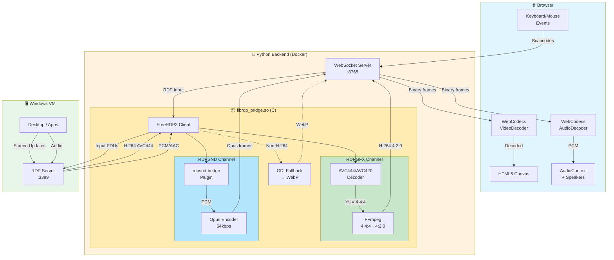

# RDP Web Client

Browser-based Remote Desktop client using vanilla JavaScript frontend and a Python WebSocket proxy with native FreeRDP3 integration.

## Architecture

```
┌─────────────┐      WebSocket          ┌─────────────────┐     RDP/GFX    ┌──────────────┐
│   Browser   │ ◄─────────────────────► │  Python Proxy   │ ◄────────────► │  Windows VM  │
│  (HTML/JS)  │   H.264 + Opus + input  │ (Native FreeRDP)│  AVC444/AVC420 │              │
└─────────────┘                         └─────────────────┘                └──────────────┘
```

### Components

- **Frontend**: Vanilla JavaScript SPA served by nginx (port 8000)
- **Backend**: Python WebSocket server with native C library for FreeRDP3 integration (port 8765)
- **Native Bridge**: C library (`librdp_bridge.so`) for direct RDP connection with zero-copy frame capture

## Features

- 🎬 **RDP GFX pipeline with H.264/AVC444** - Hardware-accelerated video streaming
- 🔄 **AVC444 → 4:2:0 transcoding** - Server-side conversion for browser compatibility
- 🖥️ Real-time screen streaming via WebSocket (H.264 or WebP fallback)
- 🔊 Native audio streaming with Opus encoding (per-session isolation)
- ⌨️ Full keyboard support with scan code translation
- 🖱️ Mouse support (move, click, drag, wheel - horizontal & vertical)
- 📺 Fullscreen mode with dynamic resolution
- 🔄 Delta frame updates with dirty rectangle tracking
- 📊 Latency monitoring (ping/pong)
- 🩺 Health check endpoint (`/health`)
- 🐳 Docker support with multi-stage builds
- 👥 Multi-user support (isolated RDP sessions per WebSocket connection)

## Todo (Best Effort)
- Clipboard support (copy/paste)
- File transfer support
- Better JS API
- NVENC/VAAPI hardware transcoding (currently software FFmpeg)

## Tech Stack

### Backend
- **Python 3.x** with `websockets` for async WebSocket server
- **Native C library** built with FreeRDP3 SDK (compiled from source with H.264 support)
- **RDPGFX channel** for H.264/AVC444 video (MS-RDPEGFX protocol)
- **FFmpeg (libavcodec)** for AVC444 → 4:2:0 transcoding
- **RDPSND bridge plugin** for direct audio capture (no PulseAudio or Alsa required)
- **libopus** for Opus audio encoding (64kbps, 20ms frames)
- **PIL/Pillow** for image processing (WebP fallback)
- **Ubuntu 24.04** base image

> **Note**: Ubuntu's FreeRDP3 package is compiled *without* H.264 support. The Docker build 
> compiles FreeRDP3 from source with `-DWITH_FFMPEG=ON` to enable H.264/AVC444 codec negotiation.

### Frontend
- **Vanilla JavaScript** (no frameworks)
- **HTML5 Canvas** for rendering RDP frames
- **WebCodecs VideoDecoder** for H.264 decoding (hardware accelerated)
- **WebCodecs AudioDecoder** for Opus decoding
- **nginx:alpine** for static file serving

### Browser Requirements
- **Chrome 94+** or **Edge 94+** or **Safari 26+** or **Firefox 130+** (required for WebCodecs AudioDecoder)

## Quick Start with Docker (Recommended)

The easiest way to run the application is using Docker Compose:

```bash
# Build and start both services
docker-compose up -d

# View logs
docker-compose logs -f

# Stop services
docker-compose down
```

- **Frontend**: http://localhost:8000
- **Backend WebSocket**: ws://localhost:8765
- **Health Check**: http://localhost:8765/health

## Manual Setup

### Backend

The backend requires building the native C library against FreeRDP3. This is best done inside Docker.

```bash
cd backend

# Using Docker (recommended)
docker build -t rdp-backend .
docker run --rm -it -p 8765:8765 rdp-backend
```

For local development without Docker (requires FreeRDP3 dev libraries):

```bash
# Install FreeRDP3 dev packages (Ubuntu 24.04+)
sudo apt install freerdp3-dev libwinpr3-dev cmake build-essential

# Build native library
cd native
cmake -B build && cmake --build build
sudo cmake --install build
sudo ldconfig

# Install Python dependencies
cd ..
pip install -r requirements.txt

# Start server
python server.py
```

### Frontend

```bash
cd frontend

# Using Docker
docker build -t rdp-frontend .
docker run --rm -it -p 8000:8000 rdp-frontend

# Or using Python's built-in server
python -m http.server 8000

# Then open http://localhost:8000
```

## Usage

1. Open http://localhost:8000 in your browser
2. Click **Connect**
3. Enter VM details:
   - **Host**: IP or hostname of Windows VM
   - **Port**: RDP port (default: 3389)
   - **Username**: Windows username
   - **Password**: Windows password
4. Click **Connect** in the modal

## WebSocket Protocol

### Client → Server Messages

| Type | Description | Fields |
|------|-------------|--------|
| `connect` | Start RDP session | `host`, `port`, `username`, `password`, `width`, `height` |
| `disconnect` | End session | - |
| `mouse` | Mouse event | `action`, `x`, `y`, `button`, `deltaX`, `deltaY` |
| `key` | Keyboard event | `action`, `code`, `key` |
| `resize` | Request resolution change | `width`, `height` |
| `ping` | Latency measurement | - |

### Server → Client Messages

| Type | Description | Fields |
|------|-------------|--------|
| `connected` | Session started | `width`, `height` |
| `disconnected` | Session ended | - |
| `error` | Error occurred | `message` |
| `pong` | Ping response | - |
| Binary (H264) | H.264 frame | 25-byte header + NAL data (GFX pipeline) |
| Binary (WebP) | Full frame | Raw WebP image data (GDI fallback) |
| Binary (DELT) | Delta frame | Header + dirty rects + WebP patches |

## Configuration

### Backend Environment Variables

| Variable | Default | Description |
|----------|---------|-------------|
| `WS_HOST` | `0.0.0.0` | WebSocket bind address |
| `WS_PORT` | `8765` | WebSocket port |
| `LOG_LEVEL` | `INFO` | Logging verbosity |
| `RDP_MAX_SESSIONS` | `100` | Maximum concurrent RDP sessions (range: 2-1000) |

### Frontend Configuration (app.js)

```javascript
const config = {
    wsUrl: 'ws://localhost:8765',      // WebSocket server URL
    mouseThrottleMs: 16,                // Mouse event throttling (~60fps)
    resizeDebounceMs: 2000,             // Resize debounce delay
};
```

## Project Structure

```
├── docker-compose.yml      # Multi-service orchestration
├── backend/
│   ├── Dockerfile          # Multi-stage build (Ubuntu 24.04)
│   ├── server.py           # WebSocket server entry point
│   ├── rdp_bridge.py       # Python wrapper for native library
│   ├── requirements.txt    # Python dependencies
│   └── native/
│       ├── CMakeLists.txt  # CMake build configuration
│       ├── rdp_bridge.c    # FreeRDP3 C implementation (+ Opus buffer)
│       ├── rdp_bridge.h    # Library header
│       └── rdpsnd_bridge.c # RDPSND audio plugin (Opus encoding)
└── frontend/
    ├── Dockerfile          # nginx:alpine image
    ├── index.html          # SPA entry point
    ├── app.js              # RDP client logic (+ H.264/Opus decoding)
    └── nginx.conf          # nginx configuration
```

## Video Architecture (GFX Pipeline)

Video uses the RDPGFX channel (MS-RDPEGFX) for H.264/AVC444 hardware-accelerated streaming:

```
┌─────────────┐      RDPGFX       ┌─────────────────┐    Transcode     ┌──────────────┐
│  Windows VM │ ──────────────►   │  Native Bridge  │ ────────────────►│  H.264 Queue │
│   (Screen)  │   AVC444 4:4:4    │  (FFmpeg decode │   AVC420 4:2:0   │  (per-user)  │
└─────────────┘   dual H.264      │   + re-encode)  │   single stream  └──────────────┘
                                  └─────────────────┘                         │
                                                                              ▼
┌─────────────┐      WebSocket    ┌─────────────────┐     WebCodecs    ┌──────────────┐
│   Browser   │ ◄───────────────  │  Python Proxy   │ ◄────────────────│ VideoDecoder │
│  (Canvas)   │   H.264 NALs      │  (rdp_bridge)   │   H.264→RGB      │  (HW accel)  │
└─────────────┘                   └─────────────────┘                  └──────────────┘
```

**Key benefits:**
- **H.264 hardware decode**: Uses browser's hardware VideoDecoder
- **AVC444 support**: Server-side transcoding converts 4:4:4 to browser-compatible 4:2:0
- **Low latency**: ultrafast/zerolatency encoding preset, no B-frames
- **YouTube-ready**: Optimized for video playback scenarios

**Codec negotiation priority:**
1. AVC444v2 (best quality, transcoded to 4:2:0)
2. AVC444 (transcoded to 4:2:0)
3. AVC420 (native browser support)
4. WebP fallback (GDI mode)

## Audio Architecture

Audio uses a custom RDPSND device plugin that captures PCM directly from FreeRDP and encodes to Opus:

```
┌─────────────┐      RDPSND       ┌─────────────────┐      Opus        ┌──────────────┐
│  Windows VM │ ──────────────►   │  rdpsnd-bridge  │ ────────────────►│  Ring Buffer │
│   (Audio)   │   PCM 44.1kHz     │  (Opus Encoder) │   64kbps frames  │  (per-user)  │
└─────────────┘                   └─────────────────┘                  └──────────────┘
                                                                              │
                                                                              ▼
┌─────────────┐      WebSocket    ┌─────────────────┐     WebCodecs    ┌──────────────┐
│   Browser   │ ◄───────────────  │  Python Proxy   │ ◄────────────────│ AudioDecoder │
│  (Speakers) │   OPUS frames     │  (rdp_bridge)   │   Opus→PCM       │              │
└─────────────┘                   └─────────────────┘                  └──────────────┘
```

**Key benefits:**
- **Per-session isolation**: Each RDP connection has its own audio buffer (no mixing)
- **No PulseAudio**: Direct capture eliminates shared audio daemon
- **Bandwidth efficient**: Opus at 64kbps vs ~1.4Mbps raw PCM
- **Low latency**: 20ms frame size

## Troubleshooting

### "Failed to load librdp_bridge.so"
The native library wasn't built or installed. Use Docker which handles this automatically.

### "Connection refused" to VM
- Verify the VM IP and RDP port (3389)
- Ensure Remote Desktop is enabled on the Windows VM
- Check firewall allows RDP connections

### Black screen after connecting
- The VM display may need to wake up - try moving the mouse
- Check if the VM is at a lock screen

### High latency / choppy video
- **Enable GFX on Windows**: Set GPO `Computer Configuration > Admin Templates > Windows Components > Remote Desktop Services > Remote Session Environment > Prioritize H.264/AVC 444 graphics mode` to **Enabled**
- The GFX pipeline uses H.264 for low-latency video (ideal for video streaming)
- Falls back to WebP if server doesn't support GFX
- Check network connectivity between backend and VM

### No audio in browser
- **Check browser compatibility**: Audio requires Chrome 94+ or Edge 94+ (WebCodecs API)
- **Check RDP server settings**: Ensure audio redirection is enabled on the Windows VM
- **Check console logs**: Look for `[OPUS]` messages confirming audio frames are received
- **Firefox/Safari**: Audio not currently supported (WebCodecs unavailable)

### Container health check failing
The backend exposes `/health` endpoint. Test with:
```bash
curl http://localhost:8765/health
```

## Architecture Diagram


