# RDP Web Client

Browser-based Remote Desktop client using vanilla JavaScript frontend and a Python WebSocket proxy with native FreeRDP3 integration.

## Architecture

```
┌───────────────────────────────┐                                        
│           Browser             │                                         
│  ┌─────────┐  ┌────────────┐  │     WebSocket       ┌─────────────────┐     RDP/GFX    ┌─────────┐
│  │ Main    │  │ GFX Worker │  │ ◄─────────────────► │  Python Proxy   │ ◄────────────► │ Windows │
│  │ Thread  │  │ (Offscreen │  │  Wire Format Proto  │ (Native FreeRDP)│  AVC444/AVC420 │   OS    │
│  │ (Audio) │  │  Canvas)   │  │  H264+SURF+TILE+... │                 │                │         │
│  └─────────┘  └────────────┘  │                     └─────────────────┘                └─────────┘
└───────────────────────────────┘                                         
```

### Components

- **Frontend**: Vanilla JavaScript SPA with GFX Worker (OffscreenCanvas) served by nginx (port 8000)
- **Backend**: Python WebSocket server with native C library for FreeRDP3 integration (port 8765)
- **Native Bridge**: C library (`librdp_bridge.so`) for direct RDP connection with GFX event streaming
- **Wire Protocol**: Binary message format with 4-byte ASCII magic headers for efficient frame transmission

## Features

- 🎬 **RDP GFX pipeline with H.264/AVC444** - Hardware-accelerated video streaming
- 🔄 **AVC444 → 4:2:0 transcoding** - Server-side FFmpeg conversion for browser compatibility
- 🖼️ **Off-main-thread rendering** - GFX Worker with OffscreenCanvas for smooth 60fps
- 🧩 **Wire format protocol** - Binary messages with typed headers (SURF, TILE, H264, etc.)
- 🎯 **Client-side GFX compositor** - Surface management, tile decoding, frame composition
- 🧮 **Progressive codec WASM decoder** - RFX Progressive tiles decoded in WebAssembly (pthreads)
- 🎨 **ClearCodec WASM decoder** - Clear codec tiles decoded in WebAssembly
- 🔊 Native audio streaming with Opus encoding (per-session isolation)
- ⌨️ Full keyboard support with scan code translation
- � **Virtual on-screen keyboard** - Touch-friendly US layout with modifier support
- �🖱️ Mouse support (move, click, drag, wheel - horizontal & vertical)
- 📺 Fullscreen mode with dynamic resolution
- 📊 Latency monitoring (ping/pong)
- 🩺 Health check endpoint (`/health`)
- 🐳 Docker support with multi-stage builds
- 👥 Multi-user support (isolated RDP sessions per WebSocket connection)

## Todo (Best Effort)
- Clipboard support (copy/paste)
- File transfer support
- NVENC/VAAPI hardware transcoding (currently software FFmpeg)

## Tech Stack

### Backend
- **Python 3.x** with `websockets` for async WebSocket server
- **Native C library** built with FreeRDP3 SDK (compiled from source with H.264 support)
- **RDPGFX channel** for H.264/AVC444 video (MS-RDPEGFX protocol)
- **GFX Event Queue** - Thread-safe queue streaming raw GFX events to frontend
- **FFmpeg (libavcodec)** for AVC444 → 4:2:0 transcoding
- **RDPSND bridge plugin** for direct audio capture (no PulseAudio or Alsa required)
- **libopus** for Opus audio encoding (64kbps, 20ms frames)
- **Ubuntu 24.04** base image

> **Note**: Ubuntu's FreeRDP3 package is compiled *without* H.264 support. The Docker build 
> compiles FreeRDP3 from source with `-DWITH_FFMPEG=ON` to enable H.264/AVC444 codec negotiation.

### Frontend
- **Vanilla JavaScript** (no frameworks, ES modules)
- **GFX Worker** - Web Worker for off-main-thread rendering
- **OffscreenCanvas** - Hardware-accelerated canvas in worker context (REQUIRED)
- **WebCodecs VideoDecoder** for H.264 decoding in worker (hardware accelerated)
- **WebCodecs AudioDecoder** for Opus decoding (main thread)
- **Wire Format Parser** - Binary protocol with 4-byte ASCII magic headers
- **nginx:alpine** for static file serving

### Browser Requirements
- **OffscreenCanvas** support (REQUIRED - no fallback)
- **Chrome 94+** or **Edge 94+** or **Safari 26+** or **Firefox 130+** (OffscreenCanvas + WebCodecs)

## Quick Start with Docker (Recommended)

The easiest way to run the application is using Docker Compose:

```bash
# Build and start both services
docker-compose up -d

# View logs
docker-compose logs -f

# Stop services
docker-compose down
```

- **Frontend**: http://localhost:8000
- **Backend WebSocket**: ws://localhost:8765
- **Health Check**: http://localhost:8765/health

## Manual Setup

### Backend

The backend requires building the native C library against FreeRDP3. This is best done inside Docker.

```bash
cd backend
docker build -t rdp-backend .
docker run --rm -it -p 8765:8765 rdp-backend
```

### Frontend

```bash
cd frontend
docker build -t rdp-frontend .
docker run --rm -it -p 8000:8000 rdp-frontend

# Then open http://localhost:8000
```

## Frontend Integration

The RDP client is available as a reusable ES module with Shadow DOM isolation, making it easy to integrate into any web application.

### Required HTTP Headers

The frontend requires cross-origin isolation headers for SharedArrayBuffer support (used by WASM pthreads). Your web server must include these headers:

```nginx
# Required for SharedArrayBuffer (WASM pthreads)
# These headers enable cross-origin isolation
add_header Cross-Origin-Opener-Policy "same-origin" always;
add_header Cross-Origin-Embedder-Policy "require-corp" always;
```

Without these headers, the progressive codec WASM decoder will not function. The included `nginx.conf` already has these configured.

### Quick Start

#### 1. Import the module

```javascript
import { RDPClient } from './rdp-client.js';
```

#### 2. Create an instance

```javascript
const client = new RDPClient(document.getElementById('container'), {
  wsUrl: 'ws://localhost:8765',
  showTopBar: true,    // Show/hide the connection toolbar
  showBottomBar: true  // Show/hide the status bar
});
```

#### 3. Connect programmatically

```javascript
await client.connect({
  host: '192.168.1.100',
  port: 3389,
  user: 'Administrator',
  pass: 'password'
});
```

### Configuration Options

| Option | Type | Default | Description |
|--------|------|---------|-------------|
| `wsUrl` | string | `'ws://localhost:8765'` | WebSocket server URL |
| `showTopBar` | boolean | `true` | Show/hide the top toolbar |
| `showBottomBar` | boolean | `true` | Show/hide the bottom status bar |
| `reconnectDelay` | number | `3000` | Reconnection delay in milliseconds |
| `mouseThrottleMs` | number | `16` | Mouse move event throttle (~60fps) |
| `resizeDebounceMs` | number | `2000` | Resize debounce delay |
| `keepConnectionModalOpen` | boolean | `false` | Keep connection modal open when not connected |

### Public API

| Method | Description |
|--------|-------------|
| `connect(credentials)` | Connect to RDP server. Returns a Promise. |
| `disconnect()` | Disconnect the current session |
| `sendKeys(keys, opts)` | Send keystrokes. Options: `{ ctrl, alt, shift, meta, delay }` |
| `sendKeyCombo(combo)` | Send key combination (e.g., `'Ctrl+Alt+Delete'`) |
| `sendCtrlAltDel()` | Shortcut for `sendKeyCombo('Ctrl+Alt+Delete')` |
| `showKeyboard()` | Show the virtual on-screen keyboard |
| `hideKeyboard()` | Hide the virtual on-screen keyboard |
| `isKeyboardVisible()` | Returns `true` if virtual keyboard is visible |
| `getStatus()` | Returns `{ connected, resolution, muted }` |
| `getMuted()` | Returns current mute state (boolean) |
| `setMuted(bool)` | Set audio mute state |
| `getResolution()` | Returns `{ width, height }` or `null` if not connected |
| `on(event, handler)` | Register an event handler |
| `off(event, handler)` | Remove an event handler |
| `destroy()` | Clean up resources and remove from DOM |

### Events

| Event | Data | Description |
|-------|------|-------------|
| `'connected'` | `{ width, height }` | RDP session established |
| `'disconnected'` | - | Session ended |
| `'resize'` | `{ width, height }` | Resolution changed |
| `'error'` | `{ message }` | Error occurred |
| `'keyboardShow'` | - | Virtual keyboard was shown |
| `'keyboardHide'` | - | Virtual keyboard was hidden |

### Virtual Keyboard

The RDP client includes a built-in virtual on-screen keyboard, ideal for touch devices or when physical keyboard access is limited.

#### Features

- **US keyboard layout** (without numeric keypad)
- **Movable & resizable** overlay that stays within canvas bounds
- **Touch-friendly** with support for both mouse and touch events
- **Modifier key toggle** - Shift, Ctrl, Alt, and Win keys stay pressed until a regular key is typed
- **Special key combos**:
  - `Alt+Tab` - Switch windows
  - `Ctrl+Alt+Delete` - Security attention sequence
- **Scalable UI** - Keyboard scales between 50% and 120% of its original size

#### Usage

```javascript
// Show the virtual keyboard
client.showKeyboard();

// Hide the virtual keyboard
client.hideKeyboard();

// Check visibility
if (client.isKeyboardVisible()) {
  console.log('Keyboard is open');
}

// Listen for keyboard events
client.on('keyboardShow', () => console.log('Keyboard opened'));
client.on('keyboardHide', () => console.log('Keyboard closed'));
```

The keyboard can also be toggled using the ⌨️ button in the top toolbar when connected.

### Full Example

```html
<!DOCTYPE html>
<html>
<head>
  <title>My RDP App</title>
  <style>
    #rdp-container {
      width: 100%;
      height: 600px;
    }
  </style>
</head>
<body>
  <div id="rdp-container"></div>
  
  <script type="module">
    import { RDPClient } from './rdp-client.js';

    const client = new RDPClient(document.getElementById('rdp-container'), {
      wsUrl: 'ws://localhost:8765',
      showTopBar: true,
      showBottomBar: false
    });

    // Event handlers
    client.on('connected', ({ width, height }) => {
      console.log(`Connected at ${width}x${height}`);
    });

    client.on('disconnected', () => {
      console.log('Session ended');
    });

    client.on('error', ({ message }) => {
      console.error('RDP Error:', message);
    });

    client.on('resize', ({ width, height }) => {
      console.log(`Resolution changed to ${width}x${height}`);
    });

    // Connect automatically
    client.connect({
      host: '192.168.1.100',
      port: 3389,
      user: 'admin',
      pass: 'secret'
    }).catch(err => console.error(err));

    // Expose for debugging
    window.rdpClient = client;
  </script>
</body>
</html>
```

## Usage

1. Open http://localhost:8000 in your browser
2. Click **Connect**
3. Enter VM details:
   - **Host**: IP or hostname of Windows VM
   - **Port**: RDP port (default: 3389)
   - **Username**: Windows username
   - **Password**: Windows password
4. Click **Connect** in the modal

## WebSocket Protocol

### Client → Server Messages (JSON Format)

| Type | Description | Fields |
|------|-------------|--------|
| `connect` | Start RDP session | `host`, `port`, `username`, `password`, `width`, `height` |
| `disconnect` | End session | - |
| `mouse` | Mouse event | `action`, `x`, `y`, `button`, `deltaX`, `deltaY` |
| `key` | Keyboard event | `action`, `code`, `key` |
| `resize` | Request resolution change | `width`, `height` |
| `ping` | Latency measurement | - |

### Server → Client Messages (JSON Format)

| Type | Description | Fields |
|------|-------------|--------|
| `connected` | Session started | `width`, `height` |
| `disconnected` | Session ended | - |
| `error` | Error occurred | `message` |
| `pong` | Ping response | - |

### Server → Client Messages (Wire Format)

All binary messages use a 4-byte ASCII magic header for efficient parsing:

| Magic | Type | Description |
|-------|------|-------------|
| `SURF` | createSurface | Create a new GFX surface |
| `DELS` | deleteSurface | Delete a surface |
| `MAPS` | mapSurfaceToOutput | Map surface to primary output |
| `STFR` | startFrame | Begin frame composition |
| `ENFR` | endFrame | End frame, commit to screen |
| `H264` | H.264 frame | Encoded video NAL units |
| `WEBP` | WebP tile | Compressed image tile |
| `TILE` | Raw tile | Uncompressed RGBA pixels |
| `PROG` | Progressive tile | RFX Progressive compressed (WASM decoded) |
| `CLRC` | ClearCodec tile | ClearCodec compressed (WASM decoded) |
| `SFIL` | solidFill | Fill rectangle with color |
| `S2SF` | surfaceToSurface | Copy region between surfaces |
| `S2CH` | surfaceToCache | Store surface region in bitmap cache |
| `C2SF` | cacheToSurface | Restore cached bitmap to surface |
| `EVCT` | evictCache | Delete bitmap cache slot |
| `RSGR` | resetGraphics | Reset all GFX state (surfaces, cache, codec) |
| `OPUS` | Audio frame | Opus-encoded audio |
| `AUDI` | PCM Audio | Raw PCM audio data |

### Client → Server Messages (Wire Format)

| Magic | Type | Description |
|-------|------|-------------|
| `FACK` | frameAck | Acknowledge frame completion |
| `BPRS` | backpressure | Signal decode queue pressure |


## Configuration

### Backend Environment Variables

| Variable | Default | Description |
|----------|---------|-------------|
| `WS_HOST` | `0.0.0.0` | WebSocket bind address |
| `WS_PORT` | `8765` | WebSocket port |
| `LOG_LEVEL` | `INFO` | Logging verbosity |
| `RDP_MAX_SESSIONS` | `100` | Maximum concurrent RDP sessions (range: 2-1000) |

### Frontend Configuration (rdp-client.js)

```javascript
const client = new RDPClient(container, {
    wsUrl: 'ws://localhost:8765',      // WebSocket server URL
    mouseThrottleMs: 16,                // Mouse event throttling (~60fps)
    resizeDebounceMs: 2000,             // Resize debounce delay
});
```


## Project Structure

```
├── docker-compose.yml      # Multi-service orchestration
├── backend/
│   ├── Dockerfile          # Multi-stage build (Ubuntu 24.04)
│   ├── server.py           # WebSocket server entry point
│   ├── rdp_bridge.py       # Python wrapper for native library
│   ├── wire_format.py      # Binary message builders (SURF, TILE, H264, etc.)
│   ├── requirements.txt    # Python dependencies
│   └── native/
│       ├── CMakeLists.txt  # CMake build configuration
│       ├── rdp_bridge.c    # FreeRDP3 + GFX event queue + FFmpeg transcoding
│       ├── rdp_bridge.h    # Library header
│       ├── rdpsnd_bridge.c # RDPSND audio plugin (Opus encoding)
│       └── GFX_DEBUGGING_NOTES.md  # GFX pipeline debugging notes
└── frontend/
    ├── Dockerfile          # nginx:alpine image
    ├── index.html          # SPA entry point
    ├── rdp-client.js       # RDP client (Shadow DOM, WebSocket, audio)
    ├── gfx-worker.js       # GFX compositor worker (OffscreenCanvas, H.264, WASM)
    ├── wire-format.js      # Binary protocol parser
    ├── nginx.conf          # nginx configuration
    ├── progressive/        # RFX Progressive codec WASM decoder (Emscripten)
    │   ├── progressive_wasm.c
    │   ├── rfx_decode.c
    │   ├── rfx_dwt.c
    │   └── rfx_rlgr.c
    └── clearcodec/         # ClearCodec WASM decoder (Emscripten)
        └── clearcodec_wasm.c
```

## Video Architecture (GFX Pipeline)

The RDPGFX channel (MS-RDPEGFX) provides a client-side compositor with off-main-thread rendering:

### GFX Event Streaming Architecture
```
┌─────────────┐    AVC444/420     ┌─────────────────┐    Wire Format    ┌──────────────────┐
│  Windows VM │ ──────────────►   │  Native Bridge  │ ─────────────────►│  GFX Event Queue │
│   (Desktop) │   GFX Commands    │  (C Library)    │   SURF/TILE/H264  │  (Thread-safe)   │
└─────────────┘                   └─────────────────┘                   └──────────────────┘
                                         │                                       │
                                         │ FFmpeg Transcode                      │
                                         │ (AVC444 → AVC420)                     ▼
                                         │                              ┌──────────────────┐
                                         │                              │  Python Backend  │
                                         └──────────────────────────────│  (WebSocket)     │
                                                                        └──────────────────┘
                                                                                 │
                                           WebSocket Binary Messages             │
                                           (SURF, H264, TILE, WEBP, ...)         │
                                                                                 ▼
┌────────────────────────────────────────────────────────────────────────────────────────────┐
│                                        Browser                                             │
│  ┌───────────────────────┐           postMessage          ┌───────────────────────────┐    │
│  │      Main Thread      │ ─────────────────────────────► │       GFX Worker          │    │
│  │  • WebSocket receive  │                                │  • Wire format parsing    │    │
│  │  • Audio decode/play  │ ◄───────────────────────────── │  • Surface management     │    │
│  │  • Keyboard/mouse     │        frameAck/backpressure   │  • H.264 VideoDecoder     │    │
│  │  • UI events          │                                │  • Tile decoding          │    │
│  └───────────────────────┘                                │  • Frame composition      │    │
│                                                           │  • OffscreenCanvas render │    │
│                                                           └───────────────────────────┘    │
└────────────────────────────────────────────────────────────────────────────────────────────┘
```

### Wire Format Protocol

All GFX events are encoded with a 4-byte ASCII magic header:

```
┌───────┬────────────────────────────────────────────────────┐
│ Magic │ Payload (variable length, little-endian)           │
│ 4B    │ frameId, surfaceId, x, y, width, height, data, ... │
└───────┴────────────────────────────────────────────────────┘
```

#### Surface Management

| Magic | Event | Payload (bytes) |
|-------|-------|----------------|
| `SURF` | createSurface | surfaceId(2) + width(2) + height(2) + format(2) = 8B |
| `DELS` | deleteSurface | surfaceId(2) = 2B |
| `MAPS` | mapSurfaceToOutput | surfaceId(2) + outputX(2) + outputY(2) = 6B |
| `RSGR` | resetGraphics | width(2) + height(2) = 4B |

#### Frame Lifecycle

| Magic | Event | Payload (bytes) |
|-------|-------|----------------|
| `STFR` | startFrame | frameId(4) = 4B |
| `ENFR` | endFrame | frameId(4) = 4B |
| `FACK` | frameAck | frameId(4) + totalFramesDecoded(4) = 8B |
| `BPRS` | backpressure | level(1) = 1B |

#### Tile Codecs

| Magic | Event | Payload (bytes) |
|-------|-------|----------------|
| `H264` | H.264 frame | frameId(4) + surfaceId(2) + codecId(2) + frameType(1) + x(2) + y(2) + w(2) + h(2) + nalSize(4) + chromaSize(4) + NAL data |
| `PROG` | Progressive tile | frameId(4) + surfaceId(2) + x(2) + y(2) + w(2) + h(2) + dataSize(4) + data = 18B header |
| `CLRC` | ClearCodec tile | frameId(4) + surfaceId(2) + x(2) + y(2) + w(2) + h(2) + dataSize(4) + data = 18B header |
| `WEBP` | WebP tile | frameId(4) + surfaceId(2) + x(2) + y(2) + w(2) + h(2) + dataSize(4) + data = 18B header |
| `TILE` | Raw RGBA tile | frameId(4) + surfaceId(2) + x(2) + y(2) + w(2) + h(2) + dataSize(4) + data = 18B header |

#### Surface Operations

| Magic | Event | Payload (bytes) |
|-------|-------|----------------|
| `SFIL` | solidFill | frameId(4) + surfaceId(2) + x(2) + y(2) + w(2) + h(2) + color(4) = 18B |
| `S2SF` | surfaceToSurface | frameId(4) + srcId(2) + dstId(2) + srcX(2) + srcY(2) + srcW(2) + srcH(2) + dstX(2) + dstY(2) = 20B |
| `S2CH` | surfaceToCache | frameId(4) + surfaceId(2) + cacheSlot(2) + x(2) + y(2) + w(2) + h(2) = 16B |
| `C2SF` | cacheToSurface | frameId(4) + surfaceId(2) + cacheSlot(2) + dstX(2) + dstY(2) = 12B |
| `EVCT` | evictCache | frameId(4) + cacheSlot(2) = 6B |

### GFX Worker Responsibilities

The GFX Worker handles all rendering on a dedicated thread:

1. **Surface Management**: Create/delete surfaces, map to output, track dimensions
2. **H.264 Decoding**: WebCodecs VideoDecoder with hardware acceleration
3. **Progressive Decoding**: RFX Progressive codec via WASM (with pthreads support)
4. **ClearCodec Decoding**: ClearCodec tiles via WASM decoder
5. **Tile Decoding**: WebP via createImageBitmap, raw RGBA via ImageData
6. **Bitmap Cache**: Store/restore surface regions for efficient updates
7. **Frame Composition**: startFrame → tiles/H.264 → endFrame → commit
8. **Flow Control**: Frame acknowledgments (FACK) and backpressure signals (BPRS)

## Audio Architecture

Audio uses a custom RDPSND device plugin that captures PCM directly from FreeRDP and encodes to Opus:

```
┌─────────────┐      RDPSND       ┌─────────────────┐      Opus        ┌──────────────┐
│  Windows VM │ ──────────────►   │  rdpsnd-bridge  │ ────────────────►│  Ring Buffer │
│   (Audio)   │   PCM 44.1kHz     │  (Opus Encoder) │   64kbps frames  │  (per-user)  │
└─────────────┘                   └─────────────────┘                  └──────────────┘
                                                                              │
                                                                              ▼
┌─────────────┐      WebSocket    ┌─────────────────┐     WebCodecs    ┌──────────────┐
│   Browser   │ ◄───────────────  │  Python Proxy   │ ◄────────────────│ AudioDecoder │
│  (Speakers) │   OPUS frames     │  (rdp_bridge)   │   Opus→PCM       │              │
└─────────────┘                   └─────────────────┘                  └──────────────┘
```

**Key benefits:**
- **Per-session isolation**: Each RDP connection has its own audio buffer (no mixing)
- **No PulseAudio**: Direct capture eliminates shared audio daemon
- **Bandwidth efficient**: Opus at 64kbps vs ~1.4Mbps raw PCM
- **Low latency**: 20ms frame size

## Troubleshooting

### "Failed to load librdp_bridge.so"
The native library wasn't built or installed. Use Docker which handles this automatically.

### "Connection refused" to VM
- Verify the VM IP and RDP port (3389)
- Ensure Remote Desktop is enabled on the Windows VM
- Check firewall allows RDP connections

### Black screen after connecting
- The VM display may need to wake up - try moving the mouse
- Check if the VM is at a lock screen

### High latency / choppy video
- H.264 frames are decoded in the GFX Worker with hardware acceleration
- Check network connectivity between backend and VM
- Monitor browser console for decode errors

### Browser shows "OffscreenCanvas not supported"
- This application **requires OffscreenCanvas** (no fallback mode)
- Upgrade to a modern browser: Chrome 94+, Edge 94+, Firefox 130+, Safari 26+
- OffscreenCanvas is required for off-main-thread rendering in the GFX Worker

### No audio in browser
- **Check browser compatibility**: Audio requires Chrome 94+, Edge 94+, Safari 26+, or Firefox 130+ (WebCodecs AudioDecoder)
- **Check RDP server settings**: Ensure audio redirection is enabled on the Windows VM
- **Check console logs**: Look for `[OPUS]` messages confirming audio frames are received

### Container health check failing
The backend exposes `/health` endpoint. Test with:
```bash
curl http://localhost:8765/health
```

## Architecture Diagram

```mermaid
flowchart TB
    subgraph Browser["🌐 Browser"]
        subgraph MainThread["Main Thread"]
            WS_Client["WebSocket Client"]
            AudioDecoder["WebCodecs<br/>AudioDecoder"]
            AudioCtx["AudioContext<br/>+ Speakers"]
            Input["Keyboard/Mouse<br/>Events"]
        end
        
        subgraph GFXWorker["GFX Worker (Dedicated Thread)"]
            WireParser["Wire Format<br/>Parser"]
            SurfaceMgr["Surface<br/>Manager"]
            BitmapCache["Bitmap<br/>Cache"]
            VideoDecoder["WebCodecs<br/>VideoDecoder"]
            ProgWasm["Progressive<br/>WASM Decoder"]
            ClearWasm["ClearCodec<br/>WASM Decoder"]
            TileDecoder["Tile Decoder<br/>(WebP/RGBA)"]
            Compositor["Frame<br/>Compositor"]
            OffscreenCanvas["OffscreenCanvas"]
        end
    end

    subgraph Backend["🐍 Python Backend (Docker)"]
        WS_Server["WebSocket Server<br/>:8765"]
        WireFormat["Wire Format<br/>Builder"]
        
        subgraph Native["📦 librdp_bridge.so (C)"]
            FreeRDP["FreeRDP3 Client"]
            GFXQueue["GFX Event Queue<br/>(Thread-safe)"]
            
            subgraph GFX["RDPGFX Channel"]
                H264Codecs["H.264 Codecs<br/>(AVC420/444)"]
                FFmpeg["FFmpeg Transcode<br/>4:4:4 → 4:2:0"]
                TileCodecs["Tile Codecs<br/>(Planar/WebP)"]
                ProgCodec["Progressive/Clear<br/>(passthrough)"]
                SurfaceOps["Surface Ops<br/>(Fill/Copy/Cache)"]
            end
            
            subgraph Audio["RDPSND Channel"]
                Bridge["rdpsnd-bridge"]
                Opus["Opus Encoder"]
            end
        end
    end

    subgraph WindowsVM["🖥️ Windows VM"]
        RDP["RDP Server<br/>:3389"]
        Desktop["Desktop / Apps"]
    end

    %% RDP connection
    Desktop -->|"Screen/Audio"| RDP
    RDP -->|"RDPGFX + RDPSND"| FreeRDP
    
    %% GFX event processing
    FreeRDP --> H264Codecs
    FreeRDP --> TileCodecs
    FreeRDP --> ProgCodec
    FreeRDP --> SurfaceOps
    H264Codecs --> FFmpeg
    FFmpeg --> GFXQueue
    TileCodecs --> GFXQueue
    ProgCodec --> GFXQueue
    SurfaceOps --> GFXQueue
    
    %% Wire format encoding
    GFXQueue --> WireFormat
    WireFormat -->|"SURF/H264/PROG/CLRC/..."| WS_Server
    
    %% WebSocket to browser
    WS_Server -->|"Binary Messages"| WS_Client
    WS_Client -->|"postMessage"| WireParser
    
    %% GFX Worker processing
    WireParser --> SurfaceMgr
    WireParser --> BitmapCache
    WireParser --> VideoDecoder
    WireParser --> ProgWasm
    WireParser --> ClearWasm
    WireParser --> TileDecoder
    VideoDecoder --> Compositor
    ProgWasm --> Compositor
    ClearWasm --> Compositor
    TileDecoder --> Compositor
    SurfaceMgr --> Compositor
    BitmapCache --> Compositor
    Compositor --> OffscreenCanvas

    %% Audio flow (main thread)
    FreeRDP --> Bridge
    Bridge --> Opus
    Opus --> WS_Server
    WS_Server -->|"OPUS frames"| WS_Client
    WS_Client --> AudioDecoder
    AudioDecoder --> AudioCtx

    %% Input flow
    Input --> WS_Client
    WS_Client -->|"JSON events"| WS_Server
    WS_Server --> FreeRDP
    FreeRDP --> RDP

    %% Flow control
    Compositor -->|"frameAck"| WS_Client
    WS_Client -->|"FACK"| WS_Server

    style Browser fill:#e1f5fe
    style Backend fill:#fff3e0
    style WindowsVM fill:#e8f5e9
    style Native fill:#ffecb3
    style MainThread fill:#bbdefb
    style GFXWorker fill:#c8e6c9
    style GFX fill:#fff59d
    style Audio fill:#b3e5fc
```



### Data Flow Summary

| Source | Wire Magic | Processing Location | Output |
|--------|-----------|---------------------|--------|
| H.264 (AVC420) | `H264` | GFX Worker VideoDecoder | Canvas frame |
| H.264 (AVC444) | `H264` | Backend FFmpeg → Worker VideoDecoder | Canvas frame |
| Progressive tiles | `PROG` | GFX Worker WASM decoder (pthreads) | Canvas blit |
| ClearCodec tiles | `CLRC` | GFX Worker WASM decoder | Canvas blit |
| WebP tiles | `WEBP` | GFX Worker createImageBitmap | Canvas blit |
| Raw RGBA | `TILE` | GFX Worker ImageData | Canvas blit |
| Solid fills | `SFIL` | GFX Worker fillRect | Canvas draw |
| Surface copy | `S2SF` | GFX Worker drawImage | Canvas blit |
| Store to cache | `S2CH` | GFX Worker getImageData | Bitmap cache |
| Cache restore | `C2SF` | GFX Worker drawImage | Canvas blit |
| Evict cache | `EVCT` | GFX Worker Cache Manager | Cache cleanup |
| Create surface | `SURF` | GFX Worker Surface Manager | New canvas |
| Delete surface | `DELS` | GFX Worker Surface Manager | Cleanup |
| Map surface | `MAPS` | GFX Worker Surface Manager | Primary output |
| Reset graphics | `RSGR` | GFX Worker | Full state reset |
| Start frame | `STFR` | GFX Worker Compositor | Begin batch |
| End frame | `ENFR` | GFX Worker Compositor | Commit + ack |
| Frame ack | `FACK` | Backend (from browser) | Flow control |
| Backpressure | `BPRS` | Backend (from browser) | Throttle output |
| Audio | `OPUS` | Main Thread AudioDecoder | Speakers |
